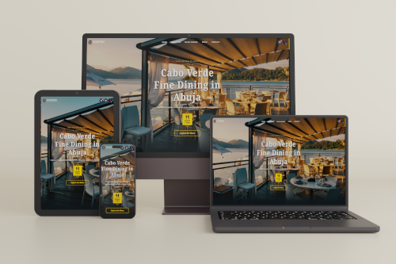
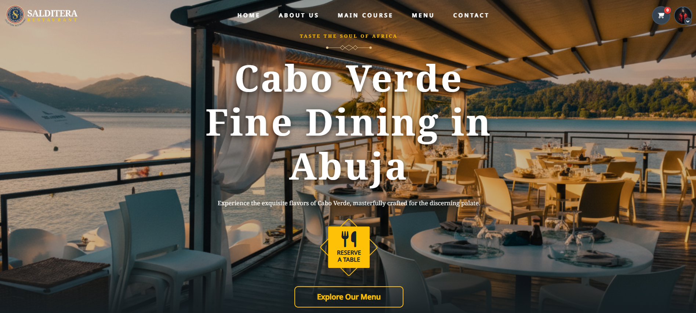
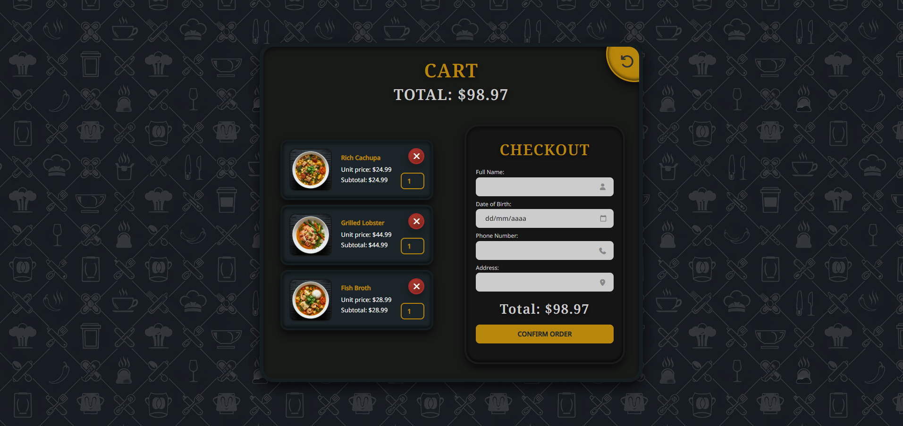
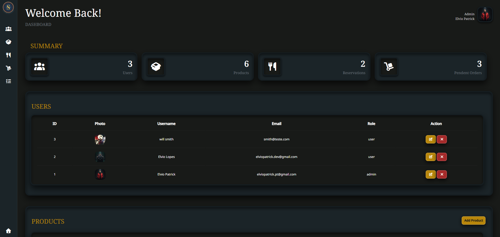

<h1 align="center">🍽️ Salditerra Restaurant - Web Application</h1>

<p align="center">

</p>

## 🌍 Sobre o Projeto
Este projeto é um website para **Salditerra Restaurant**, um restaurante de **culinária típica de Cabo Verde**, localizado em **Abuja, Nigéria**.

O sistema permite que clientes explorem o menu, façam pedidos e reservas online, enquanto administradores podem gerir produtos e utilizadores através de um painel administrativo.

O objetivo do projeto é demonstrar a construção de uma aplicação web completa utilizando tecnologias clássicas de desenvolvimento web, com foco em **usabilidade, organização do código e interação dinâmica**.

---

# 💻 Tecnologias Utilizadas

- HTML5
- CSS3
- JavaScript (AJAX)
- JSON
- PHP
- MySQL

---

# ⚡ Funcionalidades Principais

- Exibição do catálogo de **pratos típicos cabo-verdianos**
- **Carrinho de compras dinâmico** com atualização em tempo real
- **Cálculo automático do total do carrinho**
- **Gestão de utilizadores**
  - Registo
  - Login
  - Logout
- **Área administrativa**
  - Visualizar utilizadores
  - Edição de utilizador
  - Remover utilizador
  - Visualizar produtos
  - Adicionar produtos
  - Editar produtos
  - Remover produtos
  - Gestão de Pedidos
  - Gestão de itens de Pedidos
- **Reservas online**
- Importação de catálogo via **JSON (`catalog.json`)**
- Contagem de itens no carrinho em **tempo real**

---

# 📸 Screenshots

### Página Inicial


### Carrinho


### Painel Admin


---

# 📂 Estrutura de Ficheiros

```text
salditerra_restaurant/
│
├── public/
│   ├── index.php
│   ├── cart.php
│   ├── login-register.php
│   ├── profile.php
│   ├── admin.php
│   ├── edit_user.php
│   ├── add_product.php
│   ├── edit_product.php
│   │ 
│   ├── css/
│   │   └── style.css
│   │ 
│   ├── js/
│   │   └── scripts.js
│   │ 
│   ├── assets/
│   │    └── imagens
│   │ 
│   └── uploads/
│        └── imagens
│
├── backend/
│   ├── catalog.json
│   ├── cart-count.php
│   ├── import_catalog.php
│   ├── reservation.php
│   ├── update_cart.php
│   ├── delete_product.php
│   ├── add_to_cart.php
│   ├── remove_from_cart.php
│   ├── totals.php
│   └── get_products.php
│ 
├── auth/
│   ├── process_login.php
│   ├── process_register.php
│   ├── logout.php
│ 
├── config/
│   └── config.php
│
├── database/
│   └── salditerra_db.sql
│
├── .gitignore
└── README.md
```

## Front-end

| Ficheiro | Descrição |
|----------|-----------|
| `index.php` | Página inicial com destaque para os pratos |
| `cart.php` | Página do carrinho de compras |
| `login-register.php` | Página de login e registo |
| `profile.php` | Página de perfil do utilizador |
| `admin.php` | Painel de administração |
| `edit_user.php` | Edição de utilizador |
| `add_product.php` | Adição de novos produtos |
| `edit_product.php` | Edição de produtos |
| `style.css` | Estilos globais do site |
| `scripts.js` | Funcionalidades interativas |

---

## Back-end 

| Ficheiro | Descrição |
|----------|-----------|
| `config.php` | Configurações da base de dados |
| `get_products.php` | Obtenção dos produtos do catálogo |
| `reservation.php` | Processamento de reservas online |
| `delete_product.php` | Remoção de produtos |
| `import_catalog.php` | Importação de catálogo via JSON |
| `add_to_cart.php` | Adicionar produto ao carrinho |
| `remove_from_cart.php` | Remover produto do carrinho |
| `update_cart.php` | Atualizar quantidades do carrinho |
| `totals.php` | Processamento dos valores totais no painel admin |
| `cart-count.php` | Contagem de itens no carrinho |
| `process_login.php` | Processamento de login |
| `process_register.php` | Processamento de registo |
| `logout.php` | Logout |

---

## Dados e Recursos

| Pasta / Ficheiro | Descrição |
|-----------------|-----------|
| `catalog.json` | Dados iniciais do catálogo |
| `assets/` | Imagens |
| `uploads/` | Uploads de imagens de utilizadores e produtos |

---

# 🗄 Base de Dados

O sistema utiliza **MySQL** para armazenar:

- Utilizadores
- Produtos
- Pedidos
- Itens de Pedidos
- Reservas

A base de dados deve ser criada manualmente no MySQL e as tabelas podem ser importadas através de um ficheiro SQL incluído no projeto.

---

# 🛠 Requisitos

- Servidor web (Apache ou Nginx)
- PHP 7 ou superior
- MySQL
- Navegador moderno com JavaScript

Ambientes recomendados:

- XAMPP
- WAMP
- LAMP

---

# 🚀 Instalação Local

### 1️⃣ Clonar o repositório

```bash

git clone https://github.com/elviopatrickdev/salditerra_restaurant.git


